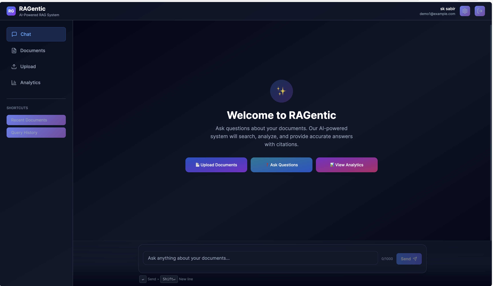
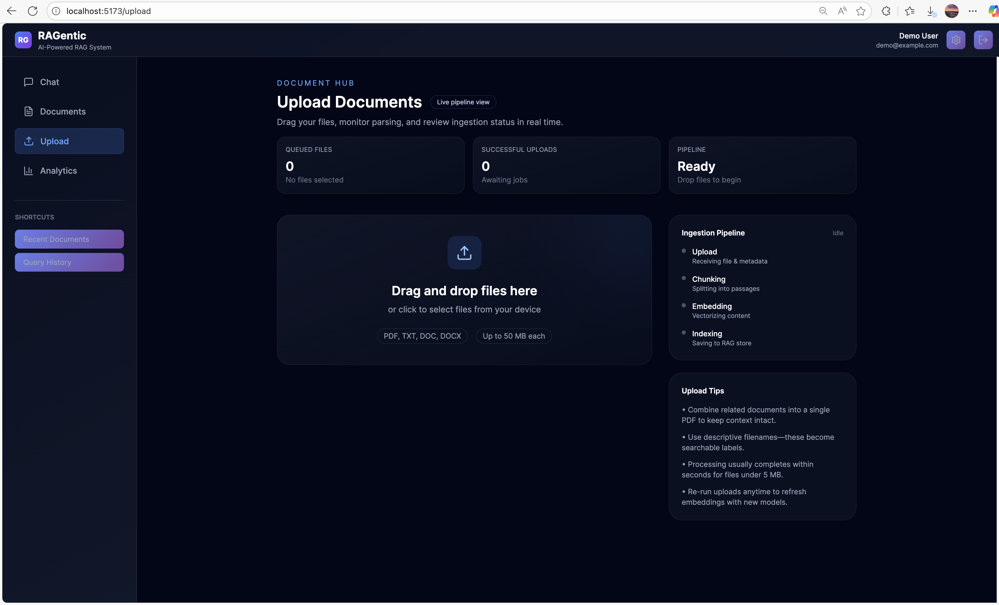

# RAGentic

Enterprise-ready retrieval-augmented generation platform with a modular multi-agent architecture, TypeScript end to end, and first-class DevOps tooling.

## Table of Contents

- [Overview](#overview)
- [System Highlights](#system-highlights)
- [Architecture Snapshot](#architecture-snapshot)
- [Screenshots](#screenshots)
- [Getting Started](#getting-started)
  - [Prerequisites](#prerequisites)
  - [Quick Start with Docker Compose](#quick-start-with-docker-compose)
  - [Manual Setup](#manual-setup)
- [Services](#services)
- [Project Structure](#project-structure)
- [Configuration](#configuration)
- [Development Workflow](#development-workflow)
- [Documentation](#documentation)
- [License & Support](#license--support)

## Overview

RAGentic combines a React frontend, an Express API gateway, and six specialized microservices to deliver production-ready retrieval-augmented generation. Upload documents, extract knowledge, and serve contextual answers with source citations, confidence scoring, and audit trails.

## System Highlights

- **Multi-agent pipeline** powered by CrewAI: ingestion, parsing, retrieval, ranking, generation, and validation agents.
- **TypeScript everywhere** with shared domain models, strong typing, and consistent linting.
- **Enterprise foundations**: JWT auth, RBAC-ready user model, rate limiting, structured logging, and distributed tracing.
- **Adaptive RAG engine** with keyword fallback, Groq/OpenAI LLM support, and document chunk management backed by pgvector similarity search.
- **Asynchronous ingestion** pipeline powered by Redis + BullMQ workers to keep uploads fast.
- **Operational visibility** with ingestion status endpoints and job history for troubleshooting.
- **Self-service reprocessing** so users can requeue documents without re-uploading data.
- **Composable infrastructure**: Docker Compose for local orchestration, Redis caching, MongoDB or Postgres pluggable via adapter layer.

## Architecture Snapshot

```
Frontend (React) ─┐
                  ├── REST API Gateway (Express) ─── Redis Cache
Agents (CrewAI) ──┘            │
                               ├── Database Adapter (Postgres | MongoDB)
                               └── AI Providers (OpenAI, Groq) → RAG Service → Clients
```

Each agent exposes a focused contract, enabling independent scaling and fault isolation. The API gateway handles authentication, document processing, query routing, and history persistence.

## Screenshots

### Dashboard


### Document Upload & Processing


### Analytics


## Getting Started

### Prerequisites

- Docker Desktop **20.10+**
- Node.js **18+** and npm **9+** (for local development)
- Optional: Python **3.11** for crew control workflows

### Quick Start with Docker Compose

#### Development Mode (Local Build)

1. Copy the environment template and update credentials/API keys as needed:

  ```bash
  cp .env.example .env
  ```

2. Launch the core services (databases, Redis, backend API, agents, frontend). Crew Control is excluded by default because its Python dependencies require extra resolution.

  ```bash
  docker compose -f docker-compose.dev.yml up -d \
    mongodb redis rabbitmq \
    backend ingestion-agent query-parser-agent retrieval-agent ranking-agent generation-agent validation-agent \
    frontend
  ```

3. Verify the stack:

  ```bash
  docker compose -f docker-compose.dev.yml ps
  curl http://localhost:3000/health          # Backend API
  curl http://localhost:3001/health || true  # Ingestion agent
  ```

Access points:

- Frontend SPA: `http://localhost:5173` (the Vite dev server behind the frontend container)
- REST API: `http://localhost:3000/api`
- Agents: `http://localhost:3001-3006`

Stop everything:

```bash
docker compose -f docker-compose.dev.yml down
```

#### Production Mode (Pre-built Images)

Deploy using published Docker Hub images:

```bash
cp .env.example .env
# Edit .env with production credentials

docker compose -f docker-compose.prod.yml up -d
```

All images are available at:
- `shazam007/ragentic-backend:latest`
- `shazam007/ragentic-frontend:latest`
- `shazam007/ragentic-{ingestion,query-parser,retrieval,ranking,generation,validation}-agent:latest`

Access production stack:
- Frontend: `http://localhost:80`
- API: `http://localhost:3000`
- Agents: `http://localhost:3001-3006`

### Manual Setup

```bash
npm run install:all        # Install root, frontend, backend dependencies

# Bring up infra locally (Mongo, Redis, RabbitMQ)
docker compose -f docker-compose.dev.yml up -d mongodb redis rabbitmq

cd backend
cp .env.example .env
edit .env  # DATABASE_TYPE=mongodb, REDIS_URL=redis://:redis123@127.0.0.1:6379/0, etc.
npm run migrate            # Apply migrations when using Postgres
npm run dev                # Starts API gateway (expects Mongo/Redis/RabbitMQ from step above)
# optional: npm run worker:documents if you want a dedicated ingestion worker process

cd ../frontend
npm run dev                # Starts Vite dev server at http://localhost:5173 (or 5174 if busy)
```

Recommended companion services for manual runs:

- MongoDB (default dev database) or Postgres (enable via `.env`)
- Redis for caching + BullMQ queue (`REDIS_URL` **must** include the password if Redis was started with `--requirepass`)
- RabbitMQ for ingestion monitoring jobs

If you prefer fully local databases instead of Docker, ensure the credentials in `.env` match your running services before invoking `npm run dev`.

## Services

| Component | Location | Purpose |
|-----------|----------|---------|
| Frontend SPA | `frontend/` | React + Vite chat interface, uploads, analytics |
| API Gateway | `backend/` | Auth, document processing, RAG orchestration |
| Agents | `agents/` | CrewAI-powered microservices for ingestion, parsing, retrieval, ranking, generation, validation |
| Crew Control | `crew-control/` | Python orchestration utilities |
| Infra | `infra/` | Infrastructure-as-code, deployment assets |

## Project Structure

```
ragentic/
├── frontend/              # React 18 + Tailwind UI, see frontend/README.md
├── backend/               # Express API gateway, see backend/README.md
├── agents/                # Specialized microservices
├── crew-control/          # CrewAI orchestration (Python)
├── infra/                 # Terraform/K8s/infra templates
├── docs/ *.md             # Architecture and process documentation
├── docker-compose.*.yml   # Environment stacks
└── package.json           # Monorepo tooling entry
```

## Configuration

- Copy `.env.example` to `.env` at the repository root.
- Key variables:
  - `DATABASE_TYPE`, `DB_*` or `MONGO_*` for persistence backend.
  - `REDIS_URL` for caching and rate limiting.
  - `VECTOR_DIMENSION` for pgvector embedding size, `DOCUMENT_INGESTION_*` for queue behaviour.
  - `OPENAI_API_KEY`, `GROQ_API_KEY`, `LLM_PROVIDER` for LLM selection.
  - `MAX_FILE_SIZE`, `ALLOWED_FILE_TYPES` for ingestion guardrails.
  - Agent URLs (`INGESTION_AGENT_URL`, etc.) when running distributed microservices.
- Frontend-specific values (e.g., `REACT_APP_API_URL`) can be overridden via environment or `.env` files inside `frontend/`.

## Development Workflow

```bash
npm run lint            # Root lint task
cd backend && npm run lint
cd frontend && npm run lint

npm test                # Run backend unit tests (Jest)
docker logs backend     # Tail API gateway logs when using Docker
npm run worker:documents # Start ingestion worker (backend)

# Formatting & quality
cd backend && npm run lint:fix
cd frontend && npm run format   # if configured via package scripts
```

Recommended steps when contributing:

1. Branch from `main`.
2. Update or add tests for behavioral changes.
3. Run lint and unit tests locally.
4. Document relevant changes in the appropriate README.

## Documentation

- **Frontend Guide**: [`frontend/README.md`](frontend/README.md)
- **Backend Guide**: [`backend/README.md`](backend/README.md)
- **Architecture Overview**: [`ARCHITECTURE.md`](ARCHITECTURE.md)
- **Agent Contracts**: [`AGENT_SPEC.md`](AGENT_SPEC.md)
- **Crew Workflows**: [`WORKFLOW.md`](WORKFLOW.md)
- **Design Decisions**: [`DESIGN_PRINCIPLES.md`](DESIGN_PRINCIPLES.md)
- **Database Options**: [`DATABASE_SETUP.md`](DATABASE_SETUP.md)
- **Implementation Checklist**: [`IMPLEMENTATION.md`](IMPLEMENTATION.md)

## License & Support

- Distributed under the MIT License (align with your organization’s compliance policies before release).
- File issues and feature requests through GitHub Issues.
- For operational questions, consult the documentation listed above or contact the maintainers referenced in project metadata.
